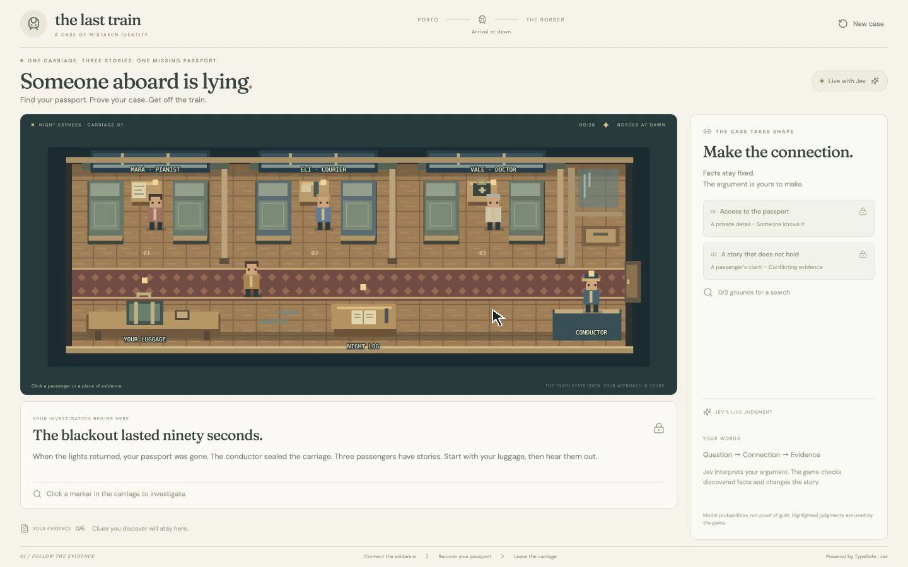

# The Last Train

A small detective escape room built with **TypeSafe Jev**, React, and Express.

Your passport disappeared during a blackout. Investigate three passengers, connect their claims to evidence, and convince the conductor to search the right bag. The player writes the deductions; Jev evaluates them; the game decides what changes.



## Run locally

Requires Node.js 22.16 or newer and pnpm 11.22.0. CI and the container use Node.js 24. Enable pnpm with `corepack enable` (or install the version pinned in `package.json`).

```sh
pnpm install --frozen-lockfile
cp .env.example .env
# Add TYPESAFE_API_KEY to .env.
pnpm dev
```

Open [localhost:4317](http://127.0.0.1:4317). Restart the server after changing environment variables. Without a key, you can inspect the carriage, but live deductions are unavailable. Failed requests never fall back to fabricated model results.

## What Jev does

Each attempted action sends the selected subject, discovered evidence, established connections, and the player's text to the server. One Jev request asks three independent questions:

- **Action — Choice:** Is this a question, an evidence challenge, a search request, an attempt to leave, or an unsupported action?
- **Connection — Choice:** Which clue-to-claim relationship does the player argue?
- **Evidence support — Noul:** Does the argument follow from the evidence actually discovered?

The server validates the response, checks the session revision, and applies only the relevant judgments. Code requires both independent grounds before allowing a search, and passport recovery before escape. The UI displays returned probabilities and the actual request. Dialogue and story facts are authored, not generated.

This is **one fixed mystery with flexible natural-language deductions**, not an unlimited dialogue engine or procedural mystery generator. The provisional acceptance thresholds are game design choices, not proof of guilt or general-purpose calibration guarantees.

## Development

```sh
pnpm format           # Format project files
pnpm check            # Formatting, TypeScript, production build, unit tests
pnpm test:production  # HTTP smoke test against the built app; no provider calls
pnpm test:live        # Optional: nine paid Jev actions against the running local server
```

`test:production` requires a completed build. `test:live` requires a running server with a configured key; it saves its results in ignored `artifacts/`. CI does not require a TypeSafe key.

## Host it

This application needs a persistent **Node.js server**. GitHub Pages and other static-only hosts cannot run the Jev proxy or game sessions.

For a Node host:

- Install: `pnpm install --frozen-lockfile`
- Build: `pnpm build`
- Start: `pnpm start`
- Health endpoint: `/api/health`
- Secret: `TYPESAFE_API_KEY`, configured in the host's secret manager

Production defaults to `HOST=0.0.0.0` and respects the host's `PORT`. If the platform removes development dependencies after building, `tsx` remains available as a production dependency. Deploy the source directories as well as `frontend/dist/`, or use the container below.

```sh
docker build -t last-train-jev .
docker run --rm -p 4317:4317 --env-file .env last-train-jev
```

The container runs as a non-root user. `.env`, recordings, dependencies, and local build output are excluded from its build context. See [deployment details](docs/deployment.md) before exposing a public instance.

## Project layout

A pnpm workspace with `frontend/` for React, `backend/` for Express and its tests, and `shared/` for the game contract used by both. Run all commands from the repository root. Each workspace owns its dependencies; no root `src/` directory is needed.

- `shared/train-game.ts` — typed story facts and deterministic state transitions
- `frontend/TrainApp.tsx` — investigation screen
- `frontend/train/` — session hook and case-panel component
- `frontend/TrainCarriage.tsx` — editable pixel-art SVG
- `backend/train.ts` — session and gameplay routes
- `backend/train-judge.ts` — Jev questions, provider request, response validation
- `backend/app.ts` — HTTP middleware and route composition
- `backend/config.ts`, `backend/rate-limit.ts` — hosting settings and request budgets
- `backend/tests/` — game, validation, configuration, and HTTP checks

## Scope and limitations

Sessions and rate limits live in memory. A restart clears them. Use a single server instance; multiple replicas need a shared session store and distributed limits. There are no accounts, saves across devices, or production analytics.

The public demo spends the host's TypeSafe credits. Built-in limits reduce abuse but are not authentication or a durable spending cap. Set a provider-side budget or put the demo behind access control when sharing with an unrestricted audience.

API keys stay server-side. The interface exposes request and response data for the current game, so player text is sent to TypeSafe and can appear in that session's trace. Do not enter personal or sensitive information into the game.

## References

- [TypeSafe HTTP API](https://docs.typesafe.ai/api)
- [Choice primitive](https://docs.typesafe.ai/primitives/choice)
- [Noul primitive](https://docs.typesafe.ai/primitives/noul)
- The installed TypeSafe skill and its upstream license are in `.agents/skills/typesafe-ai/`.
